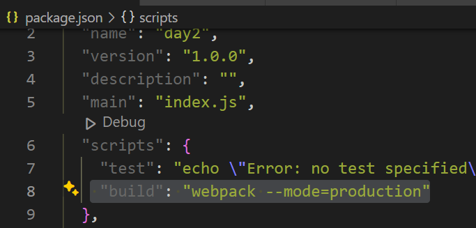

# webpack-loaders-plugins
## Objective
This assignment deepens the understanding of Webpack loaders and plugins. Configure Webpack to process CSS files using style-loader and css-loader and then optimize the CSS output for production using the MiniCssExtractPlugin.

### Initialize the Project:

- Created a new directory named webpack-loaders-plugins.
Inside the directory, initialized a new npm project with npm init -y.

### Install Webpack and Loaders:

- Installed Webpack, Webpack CLI, style-loader, and css-loader as development dependencies thru command line terminal.

### Project Structure:

- Created a src directory with an index.js file, styles.css file and index.html file in it.

### Configure Loaders and Webpack Configuration:

Created a webpack.config.js file in the project root.
- Configured the entry point as ./src/index.js and the output as bundle.js in the dist directory.

CSS Loaders:

In webpack.config.js, add a rule to use style-loader and css-loader for .css files.

### Implementing CSS in the Application

In src/styles.css, added some CSS styles eg. bg-color

Imported styles.css in src/index.js file.

### HTML Setup:

Linked bundled JavaScript file in src/index.html.
 ### Part 4: Install and Configure MiniCssExtractPlugin

Installed mini-css-extract-plugin as a development dependency.

Plugin Configuration:

Modify webpack.config.js to use MiniCssExtractPlugin for extracting CSS into separate files.
Replace style-loader with MiniCssExtractPlugin.loader.

### Production Build:

Added a script in package.json to create a production build using Webpack ("build": "webpack --mode=production").

Run the build script in terminal to generate production files.
Testing the Build:

Opened dist/index.html in a browser to ensure that the external CSS file had loaded and applied correctly displaying desired bg color.

